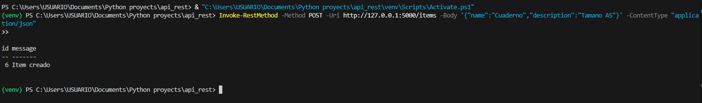
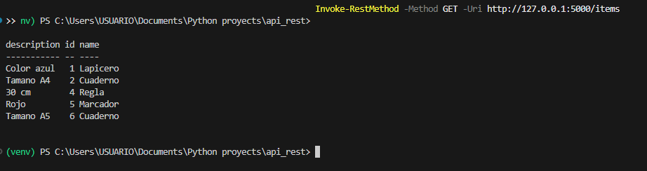

# 🧩 API REST con Flask y MySQL

Este proyecto es una **API REST básica** desarrollada con **Flask (Python)** y conectada a **MySQL**.  
Permite realizar operaciones CRUD (Crear, Leer, Actualizar y Eliminar) sobre una tabla `items`.

---

## 🚀 Tecnologías utilizadas

- **Python 3.10+**
- **Flask**
- **MySQL**
- **Flask-MySQLdb**
- **Postman** o **curl** para pruebas
- **Git / GitHub** para control de versiones

---

## 🔹 Características

- Listar todos los ítems (`GET /items`)
- Obtener un ítem por ID (`GET /items/<id>`)
- Crear un nuevo ítem (`POST /items`)
- Actualizar un ítem existente (`PUT /items/<id>`)
- Eliminar un ítem (`DELETE /items/<id>`)
- Base de datos MySQL con SQLAlchemy

---

## 📂 Estructura del proyecto

```
api_rest/
│
├── app.py # Archivo principal del servidor Flask
├── config.py # Configuración de la base de datos MySQL
├── models.py # Modelos de SQLAlchemy
├── requirements.txt # Dependencias del proyecto
├── resources/
│ └── item_resource.py # Endpoints REST
└── README.md
```

---

## ⚙️ Instalación

1. Clonar el repositorio:

```bash
git clone <URL_DEL_REPOSITORIO>
cd api_rest
```

2. Crear y activar un entorno virtual:
```bash
python -m venv venv
# Windows
venv\Scripts\activate
# macOS/Linux
source venv/bin/activate
```
3.Instalar dependencias:
```bash
pip install -r requirements.txt
```
4.Configurar la base de datos MySQL:
En tu cliente MySQL ejecuta:
```
CREATE DATABASE api_rest_db;
CREATE USER 'user'@'localhost' IDENTIFIED BY 'contraseña';
GRANT ALL PRIVILEGES ON api_rest_db.* TO 'user'@'localhost';
FLUSH PRIVILEGES;
```
5.Ejecutar la API:
```bash
python app.py
```

El servidor estará corriendo en: http://127.0.0.1:5000

## 🔍 Endpoints principales

| Método | Ruta              | Descripción                 |
|--------|-------------------|-----------------------------|
| GET    | `/items`          | Listar todos los ítems      |
| GET    | `/items/<id>`     | Obtener un ítem por ID      |
| POST   | `/items`          | Crear un nuevo ítem         |
| PUT    | `/items/<id>`     | Actualizar un ítem existente|
| DELETE | `/items/<id>`     | Eliminar un ítem            |

---

## 🖼️ Capturas de la API (desde PowerShell)

### 🔹 Crear un nuevo ítem (POST)

Este ejemplo muestra cómo crear un nuevo ítem usando PowerShell con `Invoke-RestMethod`:



### 🔹 Consultar ítems registrados (GET)

Aquí puedes ver la respuesta JSON con los ítems almacenados en la base de datos MySQL:



---

## 📦 Ejemplos de uso

### 🔹 Obtener todos los ítems (GET)
```bash
GET http://127.0.0.1:5000/items
```
Respuesta JSON:
```
json
[
  {
    "id": 1,
    "name": "Cuaderno",
    "description": "Tamaño A5"
  },
  {
    "id": 2,
    "name": "Lapicero",
    "description": "Color azul"
  }
]
```
### 🔹 Crear un nuevo ítem (POST)
```bash
POST http://127.0.0.1:5000/items
Content-Type: application/json
```
Cuerpo del request:
```
json
{
  "name": "Borrador",
  "description": "Color blanco"
}
```
Respuesta JSON:
```
json
{
  "message": "Item created successfully"
}

```
### 🔹 Obtener un ítem por ID (GET)
```bash
GET http://127.0.0.1:5000/items/1
```
Respuesta JSON:
```
json
{
  "id": 1,
  "name": "Cuaderno",
  "description": "Tamaño A5"
}

```
### 🔹 Actualizar un ítem (PUT)
```bash
PUT http://127.0.0.1:5000/items/1
Content-Type: application/json
```
Cuerpo del request:
```
json
{
  "name": "Cuaderno grande",
  "description": "Tamaño A4"
}
```
Respuesta JSON:

```
json
{
  "message": "Item updated successfully"
}

```
### 🔹 Eliminar un ítem (DELETE)
```bash
DELETE http://127.0.0.1:5000/items/1
```
Respuesta JSON:

```
json
{
  "message": "Item deleted successfully"
}
```

---

✅ Notas

Asegúrate de que MySQL esté corriendo y que la base de datos api_rest_db exista.
SQLAlchemy crea automáticamente la tabla items la primera vez que ejecutas app.py.
Puedes probar la API con Postman, PowerShell (Invoke-RestMethod) o navegador (solo GET).

---
## 🚀 Próximas mejoras

- 🔧 Agregar autenticación con JWT (tokens de acceso).  
- 📘 Conectar la API con un frontend en React o Flask.  
- 🧪 Implementar pruebas unitarias con PyTest.  
- 📄 Agregar documentación automática con Swagger (Flask-Swagger o flasgger).  
- 🗂️ Incorporar paginación y filtros en los endpoints de ítems.  

---

## 👩‍💻 Autor

**Iveth Parra Herrera**  
Desarrolladora en formación | Backend & Frontend Junior  
📍 Colombia  
🔗 [LinkedIn](https://www.linkedin.com/in/iveth-parra-herrera-351a6a235)  
💻 [GitHub](https://github.com/iparra-sys)

💡 *“El código es una herramienta para construir soluciones reales y dejar huella.”*

✨ Proyecto desarrollado como parte del Portafolio 2025 - Iveth Parra Herrera ✨
